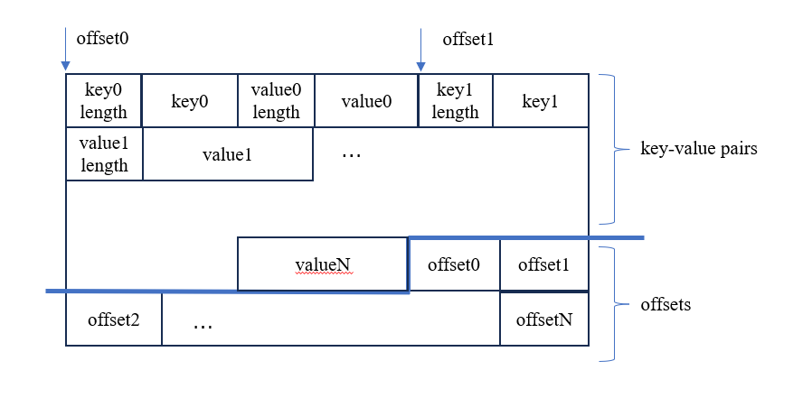
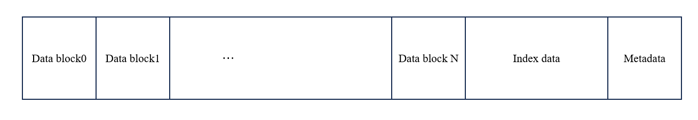

# Part 1

In part 1, you will implement 

* `BlockIterator`, `BlockBuilder`, `SSTable`, `SSTableIterator` and `SSTableBuilder`.

* `SortedRun`, `SortedRunIterator`.

* `IteratorHeap`.

* `SuperVersion`, `SuperVersionIterator` and `Version`.  

Each class contains some incomplete methods. You may add fields and methods as needed, but do not remove any existing fields or remove public methods, nor change the names of the methods.

## Block

`Block` stores internal keys and values. If you do not have time to design complex formats such as a compressed format, we highly recommend you to implement the simplest format as follows:



where the block is divided into two parts, the first part consists of key-value pairs, while the second part is an array of offsets to the key-value pairs. 

`BlockIterator` takes a pointer to the beginning of the `Block` and the `BlockHandle` of the `Block`. You can obtain useful information such as the number of key-value pairs and the size of the `Block` in `BlockHandle`. `BlockIterator::Seek(key, seq)` finds the first record larger than `(user_key, seq)` and moves to it (refer to the definition of the comparison operator in `storage/lsm/format.hpp`). `BlockIterator::SeekToFirst` moves the iterator to the beginning. You can find the comments for `Next()`, `key()`, `value()` and `Valid()` in `storage/lsm/iterator.hpp`.

`BlockBuilder` writes key-value pairs to the block until the block reaches the capacity (refer to `block_size` in `storage/lsm/options.hpp`). You need to ensure that the size of the block do not exceed `block_size`. The offsets of key-value pairs are written after all the key-value pairs are written and `BlockBuilder::FinishBlock` is called, so you need to record the offsets while writing the data.

### Test

You can test it through `test/test_lsm --gtest_filter=LSMTest.BlockTest`

## SSTable

You can implement the format as follows:



where data blocks are `Block`.

The index consists of the last key and the `BlockHandle` of each `Block`, as defined in `IndexValue` in `storage/lsm/format.hpp`. It is utilized to locate data block in `SSTable::Get`, `SSTable::Seek` and `SSTableIterator::Seek`. It is preloaded to the memory when opening the SSTable.

The bloom filter is used to test whether a key may exist in the SSTable during `SSTable::Get`. It is also preloaded to the memory.

You will implement `SSTableBuilder::Append` and `SSTableBuilder::Finish` while maintaining the information about the SSTable: `index_data_` (the index data), `index_offset_` (the offset of the index block), `largest_key_` and `smallest_key_` (which represent the key range of the SSTable). Once a SSTable is created, the information of the SSTable is transferred to the `SSTable` structure. You can use `BlockBuilder` to build data blocks. After writing all the key-value pairs, you can write the index data and the metadata to the file. Since we assume that we preload the index data when we open the SSTable, there is no need to use `Block` to store index data.

### FileWriter

You should use `FileWriter` to implement `SSTableBuilder`, `BlockBuilder`. It collects data and writes them to disk in batch. `FileWriter` provides two methods `AppendValue<T>` and `AppendString`. You can use `AppendValue<T>` to copy a value of type `T` to the file. `T` is a template parameter, it can be `uint64_t`, `float`, or structured data which do not have pointers, such as `std::pair<uint64_t, uint64_t>` and `BlockHandle`. For string data, you can use `AppendString`. Here is an example of usage:

```c++
std::string str("114514");
writer.AppendValue<uint64_t>(str.length());
      .AppendString(str);
```

If you think the methods of `FileWriter` is difficult to use, you can modify them, but DO NOT read/write to a raw file handle in `SSTableBuilder`!

### FileReader

You can use `FileReader` to read metadata and index data while initializing `SSTable`. The method `ReadValue` and `ReadString` is similar to `AppendValue` and `AppendString`. Here is an example of usage:

```c++
// Read the string "114514"
reader.Seek(offset);
auto len = reader.ReadValue<uint64_t>();
auto str = reader.ReadString(len);
```

### Bloom filter

You will build a bloom filter for each SSTable. If you are not familiar with bloom filter, you can read about it in resources such as [link](https://en.wikipedia.org/wiki/Bloom_filter). Basically, bloom filter is a bit array. For each key, it set some bits to 1. The positions of these bits are calculated using hash functions. Then, for each key, if all the corresponding bits are 1, the key may exist, otherwise it does not. 

We have implemented a bloom filter for you, which can be found in `common/bloomfilter.hpp` and `common/bloomfilter.cpp`. `BloomFilter::Create` create a bloom filter. `BloomFilter::Add` add a key to the bloom filter. Since we only use the hash of keys, you can pass the hash to `BloomFilter::Add`. `BloomFilter::Find` checks if a key may exist in the bloom filter. It can also accept the hash of keys.

In `SSTableBuilder`, you should record the hashes of keys in `SSTableBuilder::Append` and use them to build a bloom filter in `SSTableBuilder::Finish`.

### Test

You can test it through `test/test_lsm --gtest_filter=LSMTest.SSTableTest`

## SortedRun

`SortedRun` stores an array of SSTables. You will implement it based on `SSTable` and `SSTableIterator`.

### Test

You can test it through `test/test_lsm --gtest_filter=LSMTest.SortedRunTest`

## IteratorHeap

The `IteratorHeap` structure is used when performing merge-sort on multiple sorted runs. `IteratorHeap` takes references to the iterators, so you need to store the iterator in another area and pass the reference to it. The usage of `IteratorHeap` is as follows:

* First, call `IteratorHeap::Push` to pass references to the iterators to it.

* Then, if it is necessary, call `IteratorHeap::Build` to do some preprocessing.

* Then, you can use `Next`, `key`, `value`, `Valid` as an ordinary iterator. It returns the minimum record each time and call `Next` on the corresponding iterator.

We recommend you to use a heap to maintain the minimum record. You can use `std::priority_queue` or implement your own.

Note that `IteratorHeap` is a template class, if you are not familiar with it, you can read about templates in resources such as [link](https://www.runoob.com/cplusplus/cpp-templates.html). 

### Test

You can test it through `test/test_lsm --gtest_filter=LSMTest.IteratorHeapTest`

## SuperVersion

After you implement `SortedRun`, `SortedRunIterator` and `IteratorHeap`, implementing `SuperVersion` should be straightforward. 

### Test

You can test it through `test/test_lsm --gtest_filter=LSMTest.SuperVersionTest`


## Smart Pointers

We use smart pointers to manage reference counts for SSTables and sorted runs. If you are not familiar with them, you can read about smart pointers in resources such as [link](https://learn.microsoft.com/zh-cn/cpp/cpp/smart-pointers-modern-cpp?view=msvc-170).

DO NOT delete them! We rely on reference counts to support multiversion concurrency control.

