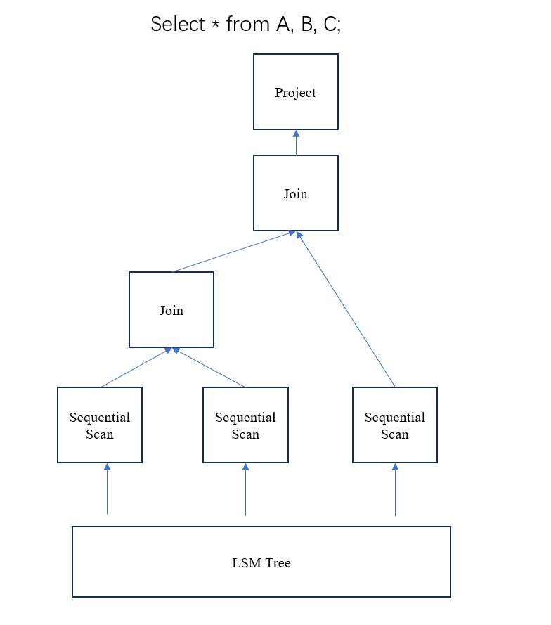
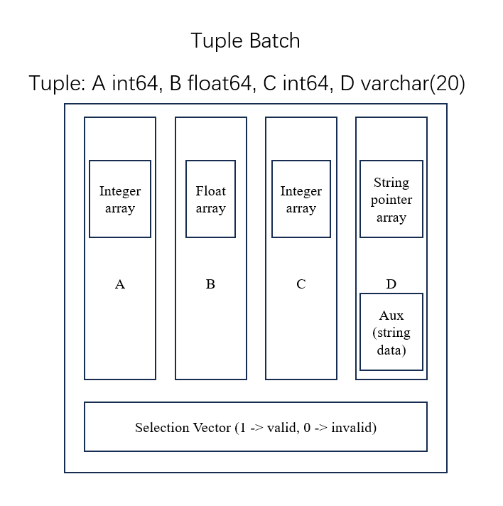

In Project 2, you will implement a pull-based vectorized execution engine.

## Vectorized engine

Volcano-style engines are simple and easy to implement, but they have poor performance due to the large overhead in virtual function calls. While they worked well in the past because disk I/O was the primary bottleneck, they are inefficient on modern CPUs and disks. Most modern query engines either use vectorization or data-centric code generation (just-in-time compilation). Vectorized engines fetch a batch of tuples instead of just one at a time, which amortizes the virtual function call overhead and can leverage SIMD (Single Instruction, Multiple Data) techniques.

In `execution/executor.hpp`, you can find the interfaces in `VecExecutor`. The interfaces are:

`Init()`: Initializes the executor.

`Next()`: Returns a batch of tuples. If there are no tuples to return, it returns an empty result.

Operators (Executors) are organized as a tree. The system calls the `Next()` function of the root operator of the tree, then the root operator calls the `Next()` functions of its children, and so on. The leaf operators of the tree are `SeqScanVecExecutor` which read tuple data from the storage engine and allocate a buffer to store them in memory. The tuple data is processed and transferred from the leaf to the root, and return to the system. The system calls `Next()` until it returns empty result.



## Data structure

The batch of tuples is stored in `TupleBatch` (refer to`type/tuple_batch.hpp`). `TupleBatch` has `Vector`s storing each column (refer to `type/vector.hpp` and `type/vector_buffer.hpp`) and a selection vector storing validation bits. The selection vector is used in cases of low selectivity (for example, when 95\% of tuples are valid, we do not need to eliminate invalid ones; instead we just mark them as invalid.). Each `Vector` has an array of elements. Each element is of type `StaticFieldRef` (refer to `type/static_field.hpp`). It is an 8-byte object that can store a 64-bit integer (`LogicalType::INT`, refer to `type/field_type.hpp`) or 64-bit float (`LogicalType::FLOAT`) or a string pointer (`LogicalType::STRING`). If the `Vector` stores strings, it stores an array of string pointers and a pointer to an auxlitary buffer (`Vector::aux_`) which stores actual string data.



The figure above shows the structure of `TupleBatch`. The types of tuple are: `LogicalType::INT`, `LogicalType::FLOAT`, `LogicalType::INT`, `LogicalType::STRING`. The `Vector` which stores column `D` has a pointer to an auxlitary buffer storing actual string data.

In `TupleBatch`, `num_tuple_` stores the number of tuples including valid ones and invalid ones, `num_valid_tuple_` stores the number of valid tuples, `capacity_` stores the maximum number of tuples. Like `capacity` and `size` in `std::vector`, `capacity_` can be larger than `num_tuple_` and tuples with indices between `num_tuple_` and `capacity_ - 1` are empty (neither valid nor invalid).

To create a `TupleBatch`, you need to call `TupleBatch::Init`. You need to get the tuple type and pass it as `std::vector<LogicalType>`. If you have an `OutputSchema`, you can call `OutputSchema::GetTypes()` to get it. You also need to pass a initial size to the function, you can use `max_batch_size_` (the maximum batch size) in `VecExecutor`, so that it will not need to resize during execution. Here is an example:

```c++
OutputSchema table0_;
TupleBatch batch;
batch.Init(table0_.GetTypes(), max_batch_size_);
```

After the `TupleBatch` is created, it is empty, you can use `TupleBatch::Append` to append tuples. Note that this function deepcopies tuple data, i.e. it copies the string data and creates a new string pointer. So you do not need to worry about the string pointers being invalid. Here is an example:

```c++
TupleBatch result_;
std::vector<StaticFieldRef> tuple;
...
// Append the tuple in std::vector<StaticFieldRef>
result_.Append(tuple);
std::vector<Vector> v;
...
// Append all tuples in std::vector<Vector>
for (int i = 0; i < tuple_cnt; i++) {
  result_.Append(v, i);
}
```

To access the j-th column of the i-th tuple, you can use `TupleBatch::Get(i, j)`. It returns a `StaticFieldRef` object, you can use `ReadInt`, `ReadFloat` or `ReadStringView` based on its type (type is not stored in `StaticFieldRef`, it is stored in other places such as `OutputSchema`). To assign a value to the j-th column of the i-th tuple, you can use `TupleBatch::Set(i, j, value)`. To get a reference to the i-th tuple, you can use `TupleBatch::GetSingleTuple(i)`, it returns a `TupleBatch::SingleTuple`, a read-only reference. You can use `operator[]` to access the j-th column in `TupleBatch::SingleTuple`, for example `GetSingleTuple(i)[j]` accesses the j-th column of the i-th tuple.

To iterate over the valid tuples in `TupleBatch`, you can use: (1) iterate over all the tuples and use `TupleBatch::IsValid` to check if they are valid, or (2) use `TupleBatch::iterator` and `for(auto :)`, it only returns valid tuples. It returns `TupleBatch::SingleTuple`, a read-only reference. Here is an example:

```c++
// 1.
TupleBatch batch;
for (uint64_t i = 0; i < batch.size(); i++) {
  if (batch.IsValid(i)) {
    // batch.Get(i, j) access the j-th column of i-th tuple.
  }
}

// 2.
TupleBatch batch;
for (auto t : batch) {
  // use t[i] to access the i-th column of the tuple
  // use batch2.Append(t) to append the tuple to another tuple batch.
}

```

`Vector` has two types: constant and flat. If its type is flat, then it stores a normal array. If its type is constant, then it is a vector in which all the elements are the same. Physically it only stores one element. It is used for constants in the expressions, or nested loop join executors. To create a vector, you need to pass the vector type (`VectorType::Flat` or `VectorType::Constant`), the element type (`LogicalType::FLOAT`, `LogicalType::STRING` and `LogicalType::INT`), and the number of elements of the vector. There is no validation information in `Vector`. It assumes that all the elements in `Vector` are valid and need to be calculated in expression evaluation.

## OutputSchema

Since SQL is a statically-typed language, the types of the output of operators are known. They are stored in `OutputSchema` (refer to `plan/output_schema.hpp`) in `PlanNode::output_schema_` (refer to `plan/plan.hpp`). You can use `OutputSchema::GetTypes` to get types in `std::vector<LogicalType>`. To get more information, you can use `OutputSchema::operator[]` or `OutputSchema::GetCols` to get the `OutputColumnData` structure, which stores table name, column name, type, etc. You may also need to concatenate two `OutputSchema`s (e.g in the join executor), you can use `OutputSchema::Concat(left, right)`.

## ExprVecExecutor

In vectorized execuction engine, expressions are evaluated in batches, greatly reducing the interpretation overhead. For each expression, we construct an executor called `ExprVecExecutor` (refer to `execution/vec/expr_vexecutor.hpp`). `ExprVecExecutor`s are organized as a tree, where the leaf nodes of the tree are input, the root node stores the result into the result `Vector`. The expression is evaluated from the bottom to the top, and inner nodes (nodes that are not leafs) may need to allocate a buffer to store temporary results. Here is an example shown in the figure below.


You can find `ExprVecExecutor` in `execution/vec/expr_vexecutor.hpp`. To create an `ExprVecExecutor`, you need to pass a pointer to `Expr`, which stores expression information, and a `OutputSchema`, which stores type information. To evaluate the expression, you need to pass a `std::span<Vector>` (`std::span` is similar to `std::string_view`, but it is used for `std::vector` or `std::array` objects) with the same types in the `OutputSchema` you passed during creation, and the number of tuples (including valid tuples and invalid tuples, i.e. the return value of `TupleBatch::size`) in the input, and a reference to the result `Vector`. Here is an example (refer to `execution/vec/project_vexecutor.hpp`):

```c++
OutputSchema input_schema; // The OutputSchema of the child executor, it has the type of input tuples.
std::unique_ptr<Expr> expr; // The expression information
expr_ = ExprVecExecutor::Create(expr.get(), input_schema);
//...
TupleBatch input;
Vector result;
// input.GetCols() returns all the columns in input.
expr_.Evaluate(input.GetCols(), input.size(), result);
```

## Use shell

If you want to execute your own SQLs, you can call `./wing <DB file name>` under build directory. The syntax is similar to PostgreSQL.

Create a table: Different from standard SQL, the columns only have 4 types: int64, float64, int32 and varchar.

```sql
create table A(a int64, b float64, c varchar(20), d int32);
create table A2(a int64 primary key, b float64); -- a is the primary key of A2
create table A3(a int64 auto_increment primary key , b float64); -- a is the primary key and it is an auto_increment value (you can always pass 0 to it while inserting and it is automatically set to 1, 2, 3, 4....)
create table A4(a int64 foreign key references A(a), b float64); -- a is a foreign key referencing A(a).
create table A5(a int64 primary key foreign key references A(a), b float64); -- a is a foreign key referencing A(a) and it is the primary key of A5.
```

Drop a table:

```sql
drop table A;
```

Insert into a table:

```sql
insert into A values (2, 3, 'dsf', 4), (6, 7, 'asd', 8);
```

Delete from a table:

```sql
delete from A where a = 2;
```

Scan a table:

```sql
select a, b * 2 from A;
```

Join two tables:

```sql
select * from A, B;
```

Join two tables on some predicates:

```sql
select * from A join B on A.a = B.a;
select * from A, B where A.a = B.a;
```

To show the plan, you can use `explain` command:

```sql
explain select * from A, B;
```

Here is a possible result:

```sql
Project [Output: a%0=A.a%0%int, a%2=B.a%2%int]
  -> Join [Predicate: ]
      -> Seq Scan [Table: A] [Predicate: ]
      -> Seq Scan [Table: B] [Predicate: ]
```

If you want to exit:
```sql
exit
```