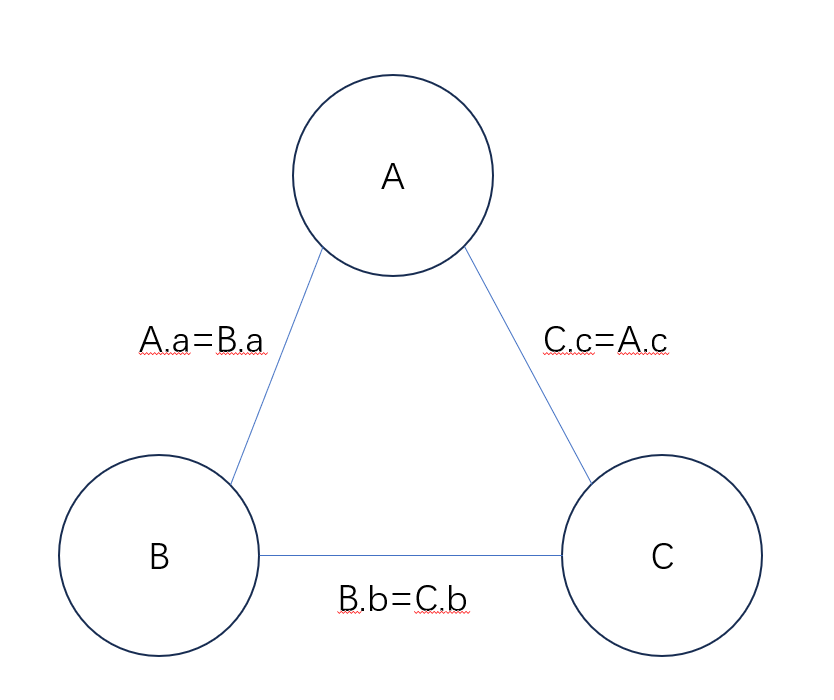
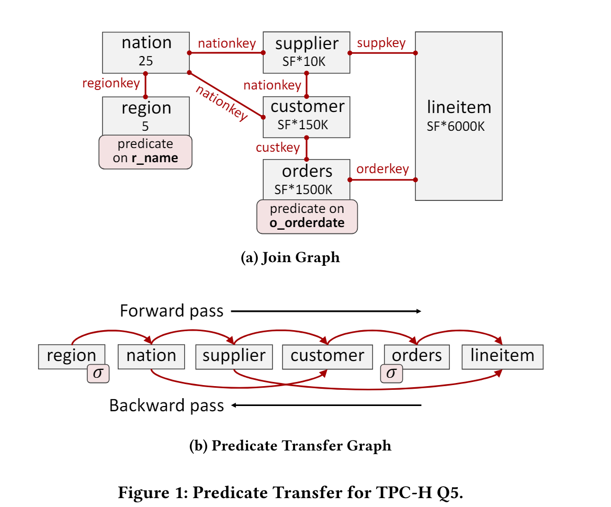
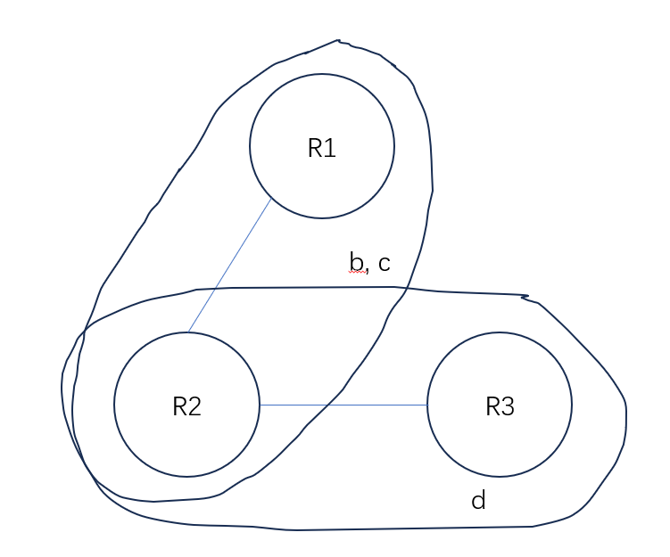
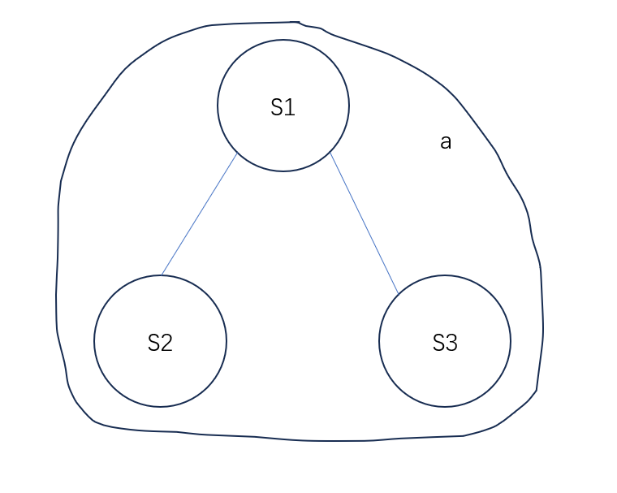

# Part 3

In part 3, you will implement the predicate transfer algorithm. 

## Predicate Transfer Overview

One of methods for enhancing join performance is to minimize the join input sizes by pre-filtering rows that will not appear in the join result. For example, predicate pushdown applies predicates on tables before executing join operations. The predicate transfer algorithm goes further. It uses other tables to create filters to filter out tuples. For example, consider a query `select * from A, B where A.id = B.id;`, suppose `A` has 10 rows and `B` has 100 rows and `B.id` is unique key. We can filter out rows in `B` where the `id` column does not appear in `A.id`. The steps of the algorithm are as follows:

(1) It creates a query graph from the query. In this graph, tables are vertices and predicates are edges. Predicates must satisfy: (1) they are equvalent conditions (2) each side contains attributes from only one table. For example, `A.a = B.a * 2` satisfies the condition. `A.a = B.a + C.a` does not because one side has attributes from two tables `B, C`. `A.a < B.a` does not because it is not an equvalent condition. The query graph for `select * from A, B, C where A.a = B.a and B.b = C.b and C.c = A.c;` is as follows:



(2) It performs forward and backward passes on the table. The forward pass traverses the query graph in a certain order and the backward pass traverses it in reverse. During these passes, the tables that are traversed earlier are used to filter out the tables that are traversed later. The filtering results are stored in bit vectors. Here is an example:



(3) It performs the join operations after tables are filtered by bit vectors.

A query is acyclic if and only if all tables can be removed through executing following steps periodically: (1) Remove an attribute if it is not in predicates. (2) Remove a table if its attributes are contained in another table's attributes or there are no other tables. If a query is acyclic, then there exists a tree $T$ with the tables as nodes such that the subgraph of $T$ induced by the nodes containing an attribute $A$ is connected for each attribute $A$.

For example, `select * from A, B, C where A.a = B.a and B.b = C.b and C.c = A.c` is not acyclic. For tables `R1(a, b, c), R2(b, c, d), R3(d, e)`, `select * from R1 natural join R2 natural join R3` is acyclic (where `natural join` is equvalent to join on same attributes between tables, here it equals the predicate `R1.b = R2.b and R1.c = R2.c and R2.d = R3.d`). You can remove all the tables by the following steps: remove attribute `e`, remove `R3`, remove attribute `d`, remove `R2`, remove `R1`. The tree for this query is:



For tables `S1(a, b), S2(a, c), S3(a, d)`, `select * from S1 natural join S2 natural join S3` is acyclic. You can remove all the tables by the following steps: remove attribute `b`, `c`, `d`, then remove `S1`, `S2`, `S3` because they contain each other. 

The tree for this query is:



The query `select * from A, B, C where A.id = B.id + C.id` is not acyclic. In fact, if there is a predicate where one side has attibutes from two or more tables, the query is not acyclic. The query `select * from A, B, C where A.id = B.id * 2 and A.id = C.id + 3` is acyclic. The `B.id * 2` is not an attribute of table `B`, but it can be considered as a new attribute of `B`. 

If the query is acyclic, then according to the Yannakakis algorithm, this algorithm can filter out all dangling tuples (tuples that will not appear in the result) and achieve the optimal time complexity $O(N+OUT)$, where $N$ is the total size of tables and $OUT$ is the output size. 

Unfortunately, if the query is not acyclic, then removing dangling tuples is NP-hard (3-SAT problem can be reduced to it by considering each clause as a table and then natural join them), the worst-case time complexity is the same as joining without predicate transfer. But in average case, this algorithm can still bring some benefit.

The Yannakakis algorithm was invented in 1980s, but it is not used by today's databases because the filtering operation is costly. However, using efficient filters such as bloom filters, the cost of filtering is greatly reduced and begins to benefit join operations.

In the project, you should: (1) Construct the query graph in `PtGraph`. (2) Create filters in `PtCreator`. We use bloom filter. (3) Filter tuples and update bit vectors in `PtUpdater`. (4) Implement `PtReducer` which performs all the operations: Calculate an order using the graph in `PtGraph`, use `PtCreator` to create filters, use `PtUpdater` to update bit vectors.

For more information, please refer to [Predicate Transfer: Efficient Pre-Filtering on Multi-Join Queries](https://www.cidrdb.org/cidr2024/papers/p22-yang.pdf).

## Modified SeqScanVecExecutor

A bit vector is added to `SeqScanVecExecutor`. This bit vector is generated in planner and it is initialized as empty. In the bit vector, 0 means the tuple at that index is invalid and 1 means valid. If the index is out of bounds, then the bits are considered as 1. An empty bit vector denotes an all-one vector. In `SeqScanVecExecutor`, it first reads tuples from storage, then it evaluates the predicates, then it checks the bit vector. The index in the bit vector increments each time a tuple passes the predicate. More specifically, the process is similar to the following pseudocode:

```cpp
tuple = /* read from storage */
predicate_.Evaluate(tuple, result); /* Get result */
/* If the tuple passes the predicate */
if (result == 1) {
  if (bit_vector_index_ >= bit_vector_.size() || bit_vector_[bit_vector_index_] == 1) {
    /* append the current tuple to result */
  }
  /* increment the indexx in bit vector */
  bit_vector_index_ += 1;
}
```

## Option

You can use `db->SetEnablePredTrans(true);` to enable predicate transfer. By default predicate transfer is not enabled.

## PtGraph

You will implement `PtGraph` in `plan/predicate_transfer/pt_graph.cpp`. `PtGraph` processes the plan generated by cost-based optimizer (your DP algorithm in part 2) in `CostBasedOptimizer::Optimize` (refer to `plan/cost_based_optimizer.cpp`), and constructs the query graph. Besides, it finds all the sequential scan plan nodes which are used by `PtCreator` and `PtUpdater`.

More specifically, you need to traverse the plan tree which only contains one project plan node at root, several join/hash join plan nodes and sequential scan plan nodes at leaves. You need to iterate over the `PredicateElement` of predicate vectors in join/hash join plan nodes and find the predicate satisfying the condition and add them into the query graph. You can use `PredicateElement::GetLeftTableName` and `PredicateElement::GetRightTableName` to get the name of the table whose attributes are referred in the left/right part. If the left/right part has attributes from two or more tables, the function returns an empty `std::optional<std::string>`. It can be detected by `std::optional<>::has_value` or `std::optional<>::operator bool`. If left/right part has no attributes the function returns an empty `std::string` (but not an empty `std::optional<std::string>`). You can just use the following code:

```cpp
for (auto& pred : pred_vec.GetVec()) {
  auto L = pred.GetLeftTableName();
  auto R = pred.GetRightTableName();
  if (L && R) {
    // check if L, R are empty strings.
    // do other checks
    // do operations...
  }
}
```

Each edge in the graph contains four members (refer to `plan/predicate_transfer/pt_graph.hpp`): `from` and `pred_from` denotes the name of table and the corresponding expression of one side. `to` and `pred_to` denotes the other side. As described above, we only consider the predicates satisfying (1) are equvalent conditions (2) each side only contains attributes from one table. The predicates satisfying these conditions always have the four members. 

More specifically, you can use the following code to construct an edge:
```cpp
auto L = pred.GetLeftTableName();
auto R = pred.GetRightTableName();
/* use Expr::clone() to deepcopy an expression */
auto edge = Edge(L.value(), R.value(), expr.GetLeftExpr()->clone(), expr.GetRightExpr()->clone());
```

We use `std::map<std::string, std::vector<Edge>>` to store the graph. The key and value of the `std::map` iare the name of table and the edges originating from the table. The graph is undirected, for each pair of tables you need to add two directed edges into the graph.

We use `std::map<std::string, std::unique_ptr<PlanNode>>` to store sequential scan nodes of tables. You need to traverse the plan tree, find all the sequential scan nodes, and add them into the map. The key of the map is the alias name of the table, you can get it using `table_name_in_sql_` in `SeqScanPlanNode`. You need to use it because this name is used by expressions in predicates. Then you need to use `PlanNode::clone` to clone a plan node to the map.

## PtCreator

You will implement `PtVecCreator` in `execution/predicate_transfer/pt_vcreator.cpp`. This structure accepts an executor which has `num_cols_` output columns. It creates bloom filters. You need to create a bloom filter for each output column using the output data and `bloom_bit_per_key_n_` (the number of bits per key in bloom filter) and store them in `result_` in order. You need to store the hash of output data, just as you did when creating bloom filters in LSM tree.

Every time you reads a tuple batch from the executor, you needs to iterate over the valid tuples in the tuple batch using `for(auto tuple : tuple_batch) {...}` or `for (uint32_t i = 0; i < tuple_batch.size(); i++) if (tuple_batch.IsValid(i)) {...}`. For each tuple, you needs to calculate the hashes of all the columns in the tuple using `utils::BloomFilter::BloomHash` and store them in arrays, and create bloom filters after all data are read. You can get the element type of $i$-th column by `tuple.GetElemType(i)` or `tuple_batch.GetElemType(i)`. You can just use the following code to get hash:

```cpp
/* Use ReadInt if the type is FLOAT or INT. */
uint64_t data = tuple[i].ReadInt();
hash = utils::BloomFilter::BloomHash(std::string_view(
    reinterpret_cast<const char*>(&data), sizeof(uint64_t)));

/* Use ReadStringView if the type is STRING */
hash = utils::BloomFilter::BloomHash(tuple[i].ReadStringView());
```

## PtUpdater

You will implement `PtVecUpdater` in `execution/predicate_transfer/pt_vupdater.cpp`. This structure accepts an executor which has `num_cols_` output columns to update the bit vector of a table. The executor scans the table and outputs some necessary expressions for checking existence. 

Be careful that the reference to the bit vector in `PtVecUpdater::Execute` references the bit vector used in the table.

Basically, for each tuple the executor returns, the corresponding bit in the bit vector is 1. You need to calculate the index of the bit vector while receiving tuples from the executor. You also need to resize the bit vector if the index is out of bounds. If the tuple should be removed because the results of expressions do not exist in the bloom filters, the 1 should be modified to 0. More specifically, you need to do the following thing:

```cpp
index = 0
while (true) {
  auto tuple_batch = executor->Init();
  /* Iterate over valid tuples in the tuple batch */
  for (auto tuple : tuple_batch) {
    while (true) {
      /* skip invalid */
      if (index < bit_vector.size() && bit_vector[index] == 0) {
        index += 1;
        continue;
      }
      if (index >= bit_vector.size()) {
        /* resize the bit vector */
        bit_vector.Resize(bit_vector.size() * 2 + 10);
        break;
      }
      break;
    }
    if (/* the result is not in bloom filter */) {
      /* set the bit to 0 */
      bit_vector[index] = 0;
    }
  }
}
```

## PtReducer

You will implement `PtReducer` in `execution/predicate_transfer/pt_reducer.cpp`. It is used to generate bit vectors for all tables before execution. More specifically, if the predicate transfer is enabled (refer to `execution/execoptions.hpp`), then a `PredicateTransferPlanNode` is created at the root of the plan node. A `PtVecExecutor` is generated based on the `PredicateTransferPlanNode` in `ExecutorGenerator`. In `PtVecExecutor`, `PtReducer::Execute()` is called first, then starts to do actual execution. In `PtReducer::Execute()`, bit vectors of tables are updated through shared pointers. 

`PtReducer` accepts a shared pointer to a `PtGraph` which is generated in cost based optimizer. It first calculates an order to do forward pass and backward pass. To pass the tests, you can just do the DFS and generate an order. For each pass, you iterates over all the tables, and for each table, you need to do: (1) If there are tables before it having edges to it, update the bit vectors using the bloom filters using `PtVecUpdater`. (2) If the table has edges to tables after it, then collect the expression and the table name. Then generate bloom filters using `PtVecCreator`. The generated bloom filters should be sent to the corresponding tables. 

To create the executors for `PtVecUpdater` and `PtVecCreator` for a table, you need to first clone the sequential scan node using the map in `PtGraph`. Then create a project plan node above it. You can create it as follows:

```cpp
auto proj_plan = std::make_unique<ProjectPlanNode>();
for (auto& expr : exprs /* exprs is std::vector<std::unique_ptr<Expr>> */) {
  proj_plan->output_exprs_.push_back(expr->clone());
  proj_plan->output_schema_.Append(
      OutputColumnData{0, "", "a", expr->ret_type_, 0});
}
proj_plan->ch_ = std::move(/* The cloned sequential scan plan node */);
```

Then you can use `ExecutorGenerator::GenerateVec` to generate the executor, using the code as follows:

```cpp
auto exe = ExecutorGenerator::GenerateVec(plan.get(), db_, txn_id_);
```

## ResultSet::GetTotalOutputSize

We use `ResultSet::GetTotalOutputSize` to test the correctness of your code. This function returns the total output size of all executors performing calculations. In the query considered in this part, it equals to: (size of all filtered tables) + (output size of all join executors) + (output size of the project executor). For example, for the first test:

```sql
create table t1(id int64, idt2 int64);
create table t2(id int64, idt1 int64);
insert into t1 values(3, 10), (4, 11);
insert into t2 values(1, 2), (2, 3);
select 1 from t1, t2 where t1.id = t2.idt1;
```

If predicate transfer is not enabled, the total output size of the last sql statement is 6 (2 from the size of table t1, 2 from the size of table t2, 1 from the join executor output size, and 1 from the project executor output size). If predicate transfer is enabled, `(4, 11)` in t1 and `(1, 2)` in t2 will be filtered out and the total output size will be 4 (1 from the size of table t1, 1 from the size of table t2, 1 from the join executor output size, and 1 from the project executor output size).

In tests the join order remains the same regardless of whether predicate transfer is enabled or not.

Since bloom filter can produce false positives, the value returned by `ResultSet::GetTotalOutputSize` may be larger than the actual value. In the tests, an epsilon is added to the result of the standard program, but if your output still exceeds the expected limit, you can consider increasing the number of bloom filter bits per key in `execution/execoptions.hpp` to a higher value (e.g. 1000). If even after this adjustment your output continues to exceed the limit, then you will need to review and check your code for potential issues.

`ResultSet::GetSize` returns the size of the result set. In the above test, it is 1.

## Test

Test your code by `test/test_opm --gtest_filter=*PredTrans*`.

In the tests you will see how predicate transfer benefits join operations. You can try to remove `db->SetEnablePredTrans(true);` and see what happens.

## Bonus

Please investigate how to choose the order of tables in the following queries:

(1) Acyclic query. In some cases, only some of orders are optimal. Please write an algorithm to find them and test your algorithm.

(2) Ring query. It is proven that ring queries cannot achieve optimal time complexity, and even some dangling tuples cannot be removed. Please find a heuristic to (1) remove dangling tuples as many as possible, or (2) improve the performance of join as much as possible. The performance of join is calculated by total output size (refer to `ResultSet::GetTotalOutputSize`).

(3) Other queries. Please find something interesting.

You do not need to solve all the problems. You can get points as long as your idea is interesting. Please submit your code and report on the Web Learning 网络学堂.


